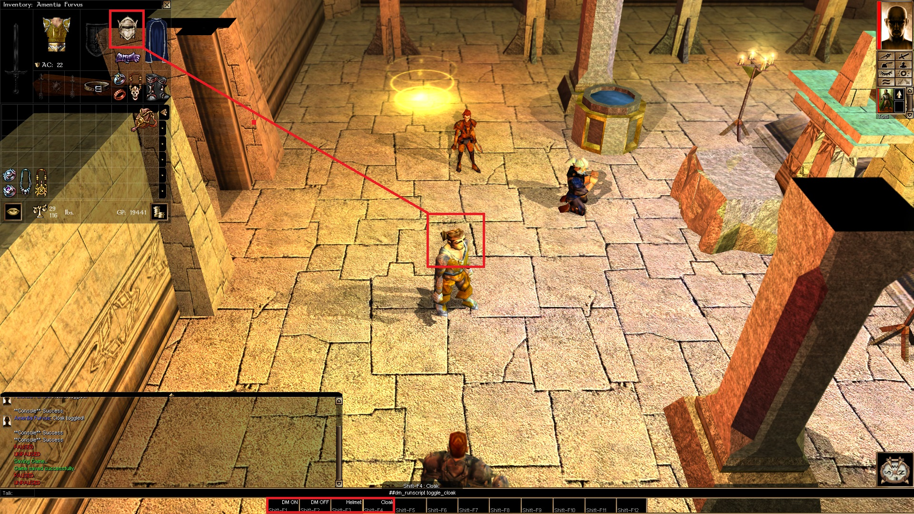

# Toggle helmet and cloak visibility in Neverwinter Nights: Enhanced Edition

### These scripts' purpose is to toggle helmet and cloak visibility on the main character without actually uneqipping them. They affect only the main character, but not other NPCs in comparison to standard `VisibleCloaks` option.

These scripts are allowed to be used in any modules, including **the official campaign modules**.

Supported versions of the game: Neverwinter Nights: **Enhanced Edition v74** and above.

**Usage Notes:**
1. Put these scripts into Neverwinter Nights' Override folder. For Steam installation on Windows it's in you documents folder.
2. Start the game.
3. Enable debug mode by typing in chat the command `##DebugMode 1`
4. To toggle helmet visibility use the `##dm_runscript toggle_helmet`
4. To toggle cloak visibility use the `##dm_runscript toggle_cloak`
4. Disable debug mode by typing the command `##DebugMode 0`
5. Enjoy!

To make it even easier I recommend creating a quickslot macro for each command for your convenience like I demonstrated in the screenshot.